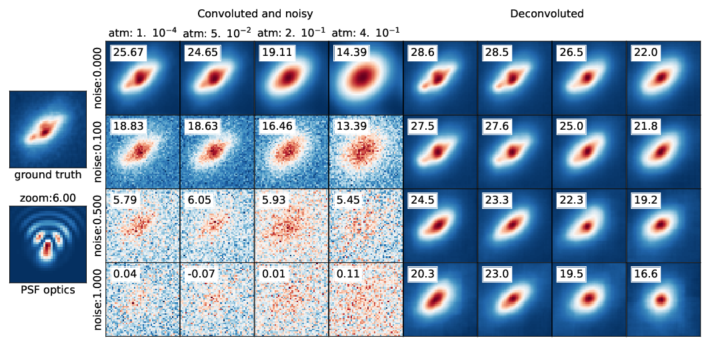
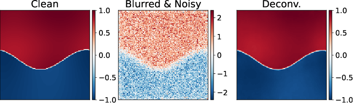
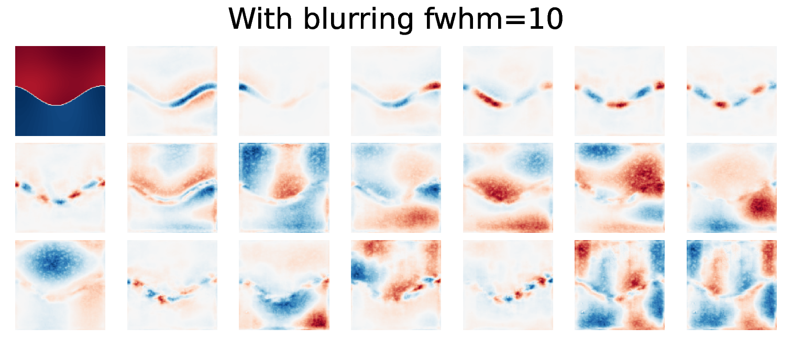

# Blind Deconvolution in Astronomy: How Does a Standalone U-Net Perform?
This is the  repository associated to the article [on arxiv](https://arxiv.org/abs/2601.08666)

We trained a U-Net on galaxy COSMOS images corrupted by genrated PSF (optical and atmospheric) convolution, and
then tested for standalone blind deconvolution. U-Net performed quite well even under challenging conditions. 



The U-Net performances are conditionend notably by the number of training images.
![SSIM U-Net vs SSIM of clean images][figs/ssim_unet_vs_ssim_obs_ntrain.png]

Evidence using $C^\alpha$ images of known backgrounds and contours regularities suggests U-Net learns a geometry-adaptive harmonic basis.

|:--:|
|  |
|  |

aligning with recent mathematical insights on denoising task by [Z. Kadkhodaie et al. (2024)(https://openreview.net/forum?id=ANvmVS2Yr0).


# External Materials

To use notebooks related to $C^\alpha$ images the train models are located in [this repository](
https://sdrive.cnrs.fr/s/wmo7cmJKsQe8oTo)

The COSMOS Real Galaxy
Dataset, used for training and validation, is available
on Zenodo [here](https://zenodo.org/records/3242143). 


# Cite
```
@article{campagne2026blinddeconvolutionastronomydoes,
      title={Blind Deconvolution in Astronomy: How Does a Standalone U-Net Perform?}, 
      author={Jean-Eric Campagne},
      year={2026},
      eprint={2601.08666},
      archivePrefix={arXiv},
      primaryClass={astro-ph.IM},
      url={https://arxiv.org/abs/2601.08666}, 
}
```
